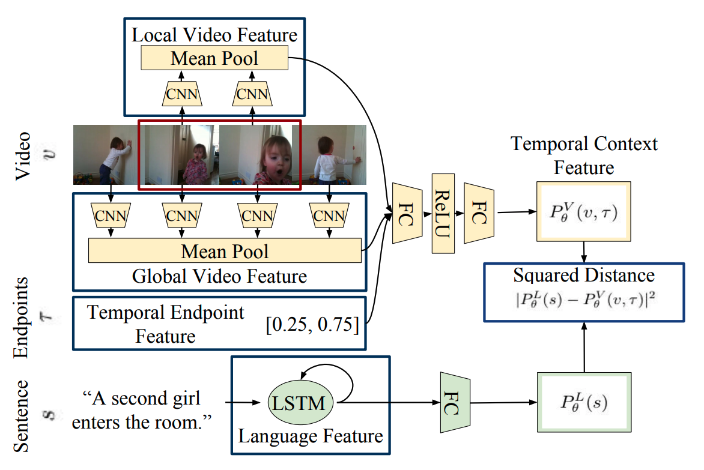

## Video Grounding

### Datasets
* [Charades-STA](https://allenai.org/plato/charades/)

  Temporal Label from paper: *TALL: Temporal Activity Localization via Language Query*\
  [Github](https://github.com/jiyanggao/TALL), [train](https://drive.google.com/file/d/1ZjG7wJpPSMIBYnW7BAG2u9VVEoNvFm5c/view), [test](https://drive.google.com/file/d/1QG4MXFkoj6JFU0YK5olTY75xTARKSW5e/view)\
  The format is "[video name] [start time] [end time]##[sentence]"

* [DiDeMo](https://github.com/LisaAnne/LocalizingMoments)

  Sample Label:
```json
{
  "num_segments": 6,
  "description": "someone kicks the bug towards some rocks.",
  "dl_link": "https://www.flickr.com/video_download.gne?id=4253489686",
  "times": [[4, 4], [4, 4], [0, 0], [4, 4], [0, 0], [0, 0], [4, 4]],
  "video": "26292851@N04_4253489686_265c3c8051.m4v",
  "annotation_id": 1
}
```

* [ActivityNet](http://activity-net.org/download.html)

  ```json
    "tVC_5_SgseY":
    {
      "duration": 137.81,
      "subset": "validation",
      "resolution": "1920x1080",
      "url": "https://www.youtube.com/watch?v=tVC_5_SgseY",
      "annotations": [
        {"segment": [39.236050618895504, 47.62074088813892], "label": "Making a sandwich"}, {"segment": [72.55981963768346, 89.9741763507275], "label": "Making a sandwich"}
      ]
    }

    "ABBQqwPOxw4":
    {
      "duration": 6.99, "subset": "validation", "resolution": "1920x1080",
      "url": "https://www.youtube.com/watch?v=ABBQqwPOxw4",
      "annotations": [{"segment": [1.6459157566302651, 6.941], "label": "Tennis serve with ball bouncing"}]
    }
  ```

* [Activity Recognition] 20BN-jester (Human gesture classification) https://20bn.com/datasets/jester/v1#download

### Surveys
1. Trends in Integration of Vision and Language Research: A Survey of Tasks, Datasets, and Methods

<!-- ### Background

* Few-shot Learning (Review): https://msiam.github.io/Few-Shot-Learning/ -->

### Papers

1. - [x] **[ICCV'17]** **[MCN]** Localizing Moments in Video with Natural Language, [paper](https://people.eecs.berkeley.edu/~lisa_anne/didemo/paper_arxiv.pdf)

1. - [x] **[ICCV'17]** **[CTRL]** TALL: Temporal Activity Localization via Language Query, [paper](https://arxiv.org/abs/1705.02101)

1. - [x] **[EMNLP'18]** Localizing Moments in Video with Temporal Language [paper](https://arxiv.org/pdf/1809.01337.pdf)
> Follow the previous papers: two ICCV paper. The only difference is to add context moments

1. - [ ] **[SIGIR'18]** Attentive Moment Retrieval in Videos [paper](https://dl.acm.org/citation.cfm?id=3210003)
> generate a set of moments candidate, which use varied moment length with 80% overlap. Cons: extremely time-consuming. The attention and cross-modal fusion are not novel but can be referenced when design any attention based model.

1. - [ ] **[CVPR'19]** MAN: Moment Alignment Network for Natural Language Moment Retrieval via Iterative Graph Adjustment [paper](https://arxiv.org/abs/1812.00087)
1. - [ ] **[CVPR'19]** Language-driven Temporal Activity Localization: A Semantic Matching Reinforcement Learning Model, [paper](http://openaccess.thecvf.com/content_CVPR_2019/html/Wang_Language-Driven_Temporal_Activity_Localization_A_Semantic_Matching_Reinforcement_Learning_Model_CVPR_2019_paper.html)

1. - [ ] **[Arxiv'19]** **[Video Collections]** Temporal Localization of Moments in Video Collections with Natural Language, [paper](https://arxiv.org/abs/1907.12763)
1. - [ ] **[NAACL'19]** ExCL: Extractive Clip Localization Using Natural Language Descriptions, [paper](https://arxiv.org/pdf/1904.02755.pdf)
1. - [ ] **[SIGIR'19]** Cross-Modal Interaction Networks for Query-Based Moment Retrieval in Videos, [paper](https://arxiv.org/pdf/1906.02497.pdf), [code](https://github.com/ikuinen/CMIN_moment_retrieval)

1. - [ ] **[Arxiv'19]** Tripping through time: Efficient Localization of Activities in Videos, [paper](https://arxiv.org/pdf/1904.09936.pdf)

1. - [ ] **[MM'19]** Exploiting Temporal Relationships in Video Moment
Localization with Natural Language, [paper](https://arxiv.org/abs/1908.03846)

1. - [ ] **[Arxiv'19]** Proposal-free Temporal Moment Localization of a Natural-Language Query in Video using Guided Attention, [paper](https://arxiv.org/abs/1908.07236)

  #### Weakly-Supervised
1. - [x] **[ACL'19]**  Weakly-Supervised Spatio-Temporally Grounding Natural Sentence in Video, [paper](https://arxiv.org/pdf/1906.02549.pdf)
1. - [x] **[EMNLP'19]** WSLLN: Weakly Supervised Natural Language Localization Networks, [paper](https://arxiv.org/abs/1909.00239)
1. - [x] **[CVPR'19]** Weakly Supervised Video Moment Retrieval from Text Queries, [paper](https://arxiv.org/pdf/1904.03282.pdf)
1. - [ ] **[Arxiv'18]** **[Object Grounding]** Weakly-Supervised Video Object Grounding from Text by Loss Weighting and Object Interaction [paper](https://arxiv.org/abs/1805.02834)

  #### Others
1. - [ ] **[Arxiv'19]** TVQA+: Spatio-Temporal Grounding for Video Question Answering
1. - [ ] **[IJCAI'19]** Localizing Unseen Activities in Video via Image Query, [paper](https://arxiv.org/pdf/1906.12165.pdf)
> grounding via image not natural language

### Research Areas
* Use external data: image caption data or video caption data
* Few-shot or zero shot learning
* Semi-Supervised Video Grounding: The input of the problem is a large set of unlabeled videos and a small set of labeled video (with query and temporal interval)
* Unsupervised Video Grounding: The input of the problem is unlabeled videos without any query and temporal interval.
* Adversarial Learning / Adversarial Attack


### Video Modeling
1. Non-local Neural Networks. [paper](https://arxiv.org/pdf/1711.07971.pdf), [caffe2](https://github.com/facebookresearch/video-nonlocal-net), [pytorch](https://github.com/AlexHex7/Non-local_pytorch)

1. 3D-ResNet: Can Spatiotemporal 3D CNNs Retrace the History of 2D CNNs and ImageNet?. [paper](https://arxiv.org/abs/1711.09577), [code](https://github.com/kenshohara/3D-ResNets-PyTorch)

### Materials
1. Github: https://github.com/TheShadow29/awesome-grounding
1. Zhihu: https://zhuanlan.zhihu.com/p/35235732
1. Zhihu: https://www.zhihu.com/question/64021205

1. 3D-ResNet: https://github.com/kenshohara/3D-ResNets-PyTorch
---------------
#### Details of Papers

###### **[ICCV'17]** **[MCN]** Localizing Moments in Video with Natural Language


Negative moments can from intra-video or inter-video
